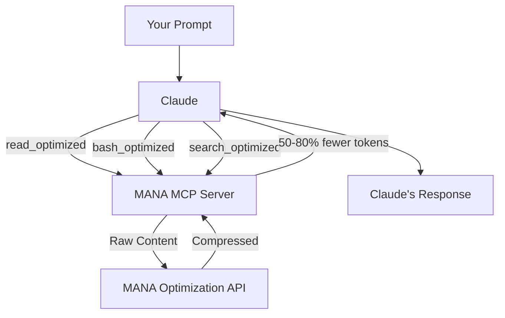

<p align="center">
  
</p>

<p align="center">
  <a href="https://github.com/scottymade/mana/releases">
    
  </a>
  <a href="https://github.com/scottymade/mana/releases">
    
  </a>
  <a href="https://devmana.ai">
    
  </a>
  <a href="https://github.com/scottymade/mana/blob/main/LICENSE">
    
  </a>
</p>

---

MANA optimizes the token-heavy tool outputs that eat through your Claude limits. File reads, command outputs, search results - they all get intelligently routed and compressed before reaching Claude, saving 50-80% of tokens on every operation. Keeping your context lean and keeping you coding longer without hitting usage caps!

**Result: 2x the coding sessions with no change to your workflow.**

---

## Your Mana Bar Has a Hole In It

*Debuff effect: Token bleed on every tool call. Here's how it stacks:*

### File Operations Are Mana Vampires

Claude Code reads an entire component file. 2,847 lines. Only 40 were relevant to your query. That's 2,800+ wasted tokens per file op. One trash mob just ate your spell slots.

### Bash Commands Siphon Mana on Every Cast

You run `npm run test`. Claude gets back 5,000 tokens - suite names, timing breakdowns, coverage reports. You just needed to know: is the build alive? Mana bar blinked red for a pulse check.

### Directory Searches Burn Through Reserves

Claude casts Locate Object to find a file. Miss. Recasts with new keywords. Miss. Third cast, broader search. Nothing batched. That's 3x the tokens for one file path.

### It's a Wipe. Pull the Combat Log — Here's What Killed You.

| 50-80% | 6-12h | 2-3x |
|--------|-------|------|
| of tokens go to tool bloat - not your actual work | actual grinding (from 25h) | faster bleed in large codebases |

**You're not bad at token management. The trash mobs wiped your mana before you even reached the boss.**

---

## How It Works

**What If You Had a Mana Regen Buff Running 24/7?** 

**_That's Mana._**

We route Claude tool calls through our custom MCP server. When Claude Code reads a 3,000-line file, Mana intercepts the bloated response, routes it through more optimized models to extract only what's relevant to your quest, then sends the filtered result back.

- Claude's full intelligence on architecture & code
- Trash mobs handled by leaner models
- Your existing workflow, unchanged
- Same firepower, at a fraction of the mana cost

Claude still handles your architecture decisions, writing clean & concise code, complex debugging, and code reviews—the actual boss fights. It just stops wasting magic on tool outputs that didn't need Claude-level intelligence in the first place.



**Smart Routing** — Every tool action routes to a lightweight model benchmarked as the most accurate for that specific job.

**Lean Processing** — Optimized models handle the heavy lifting—reading files, parsing bash outputs, extracting precise answers.

**Compounding Savings** — Leaner responses mean leaner context. Savings stack with every turn. Longer sessions, fewer tokens burned.

### Mana Pool: Doubled

| Plan | Before | With Mana |
|------|--------|-----------|
| Claude Pro | 25 hours | **50 hours** |
| Claude Max $100 | 125 hours | **250 hours** |
| Claude Max $200 | 500 hours | **1000 hours** |

**Same Claude intelligence. Double the hours. A fraction of the price!**

---

## Quick Start

### Step 1: Get Your API Key

1. Sign up at [devmana.ai](https://devmana.ai)
2. Go to **Settings > API Keys**
3. Click **Create API Key**
4. Copy your key (you'll need it in Step 2)

### Step 2: Install MANA

Choose **Project Install** (recommended) or **Global Install**:

---

#### Option A: Project Install (Recommended)

Installs MANA for a single project. Run this **in your project directory**:

```bash
curl -fsSL https://raw.githubusercontent.com/scottymade/mana/main/project-setup.sh | bash -s -- YOUR_API_KEY
```

This script automatically:
- Downloads the MANA MCP server binary
- Creates `.mcp.json` with your API key
- Installs Claude instructions (`.claude/CLAUDE.md`)

> **Note:** Add `.mcp.json` to your `.gitignore` to keep your API key private.

**That's it!** Restart Claude Code and run `/mcp` to verify MANA is connected.

---

#### Option B: Global Install

Installs MANA for all projects. Coming soon!

<!--
```bash
curl -fsSL https://raw.githubusercontent.com/scottymade/mana/main/global-setup.sh | bash -s -- YOUR_API_KEY
```
-->

---

### Manual Installation (Optional)

If you prefer to install components separately, or need to add Claude instructions to an existing global config:

#### Install Claude Instructions Manually

MANA requires instructions that tell Claude to use MANA's optimized tools. If you used the project setup script above, this is already done. Otherwise:

**Global (applies to all projects):**

```bash
curl -fsSL https://raw.githubusercontent.com/scottymade/mana/main/instructions/CLAUDE_INSTRUCTIONS.md >> ~/.claude/CLAUDE.md
```

**Per-project:**

```bash
mkdir -p .claude
curl -fsSL https://raw.githubusercontent.com/scottymade/mana/main/instructions/CLAUDE_INSTRUCTIONS.md >> .claude/CLAUDE.md
```
<!-- 
#### For Cursor

```bash
# Download to your rules folder
mkdir -p ~/.cursor/rules
curl -fsSL https://raw.githubusercontent.com/scottymade/mana/main/instructions/CLAUDE_INSTRUCTIONS.md -o ~/.cursor/rules/mana.md
```

Or for a specific project:

```bash
curl -fsSL https://raw.githubusercontent.com/scottymade/mana/main/instructions/CLAUDE_INSTRUCTIONS.md >> .cursorrules
```

#### For Windsurf

```bash
# Add to your project
curl -fsSL https://raw.githubusercontent.com/scottymade/mana/main/instructions/CLAUDE_INSTRUCTIONS.md >> .windsurfrules
```
-->

#### What the Instructions File Does

The instructions file teaches Claude to:

- Use `read_optimized` instead of the native `Read` tool
- Use `bash_optimized` instead of the native `Bash` tool
- Use `search_optimized` instead of `Glob` and `Grep`
- Use `list_directory_optimized` for directory listings

Without this file, Claude will use its built-in tools and you won't get any token savings. **This step is required for MANA to work.**

---

## Verify It's Working

After setup, ask Claude to read a file:

```
Read the package.json file and tell me what dependencies this project uses.
```

You should see output like:

```
read_optimized [EXTRACT] -> 1,247 tokens saved (72% reduction) [1,732 -> 485]
```

If you see token savings in the output, MANA is working.

---

## Troubleshooting

### "Command not found" error

Make sure the binary is in your PATH:

```bash
# Check if installed
which mana-mcp

# If not found, add to PATH or use full path in config
export PATH="$HOME/.local/bin:$PATH"
```

### Claude isn't using MANA tools

1. Verify the instructions file is installed (check `.claude/CLAUDE.md` exists)
2. Restart your IDE after making changes
3. Check that the instructions appear in your IDE's context

### "Invalid API key" error

1. Verify your key at [devmana.ai/settings](https://devmana.ai/settings)
2. Check for typos in your config file
3. Ensure the key hasn't been revoked

### API Usage
- Check your API usage on your [Mana Dashboard](https://app.devmana.ai/)

---

## Support

- **Documentation**: [Installation Docs](https://github.com/scottymade/mana/)
- **Issues**: [GitHub Issues](https://github.com/scottymade/mana/issues)
- **Bugs, Feedback and Feature Requests** can be sent via the chat feature in your [Mana Dashboard](https://app.devmana.ai/).

---

## License

Apache 2.0 - See [LICENSE](LICENSE) for details.
