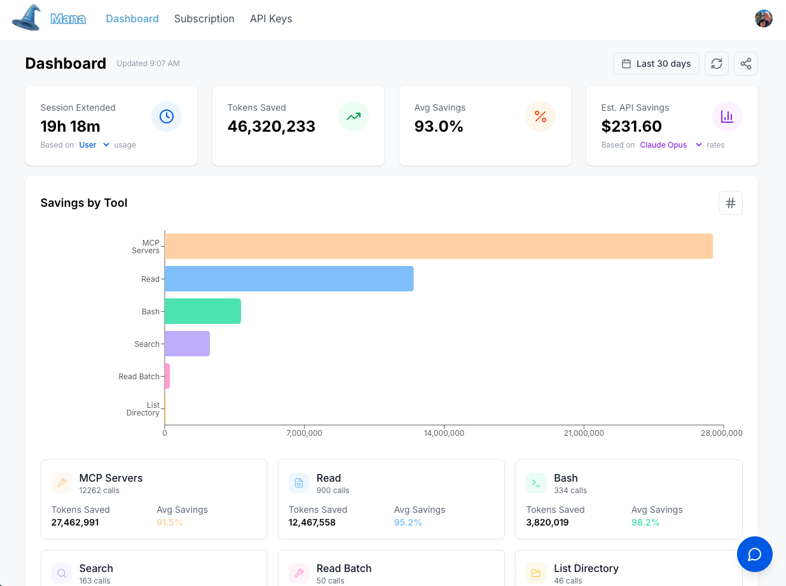

<p align="center">
  <a href="https://devmana.ai">
    
  </a>
</p>

<p align="center">
  <a href="https://github.com/scottymade/mana/releases">
    
  </a>
  <a href="https://www.npmjs.com/package/@scottymade/mana">
    
  </a>
  <a href="https://github.com/scottymade/mana/releases">
    
  </a>
  <a href="https://devmana.ai">
    
  </a>
  <a href="https://github.com/scottymade/mana/blob/main/LICENSE">
    
  </a>
</p>

---

<a href="https://devmana.ai">MANA</a> intercepts bloated tool responses and routes them through lightweight models benchmarked for task accuracy. File reads, bash outputs, search results, and MCP calls — all optimized before reaching your AI coding agent, saving 50-70% on API costs. Your agent keeps its full power for the boss fights — architecture, debugging, code generation. The minion work gets handled for a fraction of the cost.

**Result: Same AI intelligence. 50-70% less spend. No change to your workflow.**

---

## Your Mana Bar Has a Hole In It

*Debuff effect: Token bleed on every tool call. Here's how it stacks:*

### File Operations Are Mana Vampires

Your AI agent reads an entire component file. 2,847 lines. Only 40 were relevant to your query. That's 2,800+ wasted tokens per file op. One trash mob just ate your spell slots.

### Bash Commands Siphon Mana on Every Cast

You run `npm run test`. Your AI agent gets back 5,000 tokens - suite names, timing breakdowns, coverage reports. You just needed to know: is the build alive? Mana bar blinked red for a pulse check.

### Directory Searches Burn Through Reserves

Your AI agent casts Locate Object to find a file. Miss. Recasts with new keywords. Miss. Third cast, broader search. Nothing batched. That's 3x the tokens for one file path.

### It's a Wipe. Pull the Combat Log — Here's What Killed You.

| 70-90% | MCP bloat | 2-3x |
|--------|-----------|------|
| of tokens go to tool bloat — not your actual work | unfiltered API calls draining mana on every lookup | faster bleed in large codebases |

**You're not bad at token management. The debuff was running before you even started coding.**

---

## How It Works

**Reclaim Your Mana Pool**

You don't need a bigger mana pool. You need to stop the drain on the one you have.

Mana saves 50-70% of your budget from going to bloated tool responses, unfiltered MCP calls, and brute-force file searches — routing the low-level work to optimized models so you stop paying boss rates for minion work.

- Your AI agent's full intelligence on architecture & code
- Minion work routed to minion-tier models
- Your existing workflow, unchanged
- Same firepower, at a fraction of the mana cost

Your AI coding agent keeps its full power for architecture, debugging, and code generation — the actual boss fights. Mana just stops it from burning spell slots on everything else.

**Smart Routing** — Every tool action routes to a lightweight model benchmarked as the most accurate for that specific job.

**Lean Processing** — Optimized models handle the heavy lifting—reading files, parsing bash outputs, extracting precise answers.

**Compounding Savings** — Leaner responses mean leaner context. Savings stack with every turn. Longer sessions, fewer tokens burned.

### Your API Budget, Stretched 2-3x Further

| Monthly API Spend | Estimated Waste | With Mana |
|-------------------|-----------------|-----------|
| $600/mo | ~$420 goes to bloat | **Save $300-420/mo** |
| $1,500/mo | ~$1,050 goes to bloat | **Save $750-1,050/mo** |
| $2,500/mo | ~$1,750 goes to bloat | **Save $1,250-1,750/mo** |

**Same AI intelligence. 50-70% less spend. No change to your workflow.**

---

## Mana Dashboard

<p align="center">
  <a href="https://waitlist.devmana.ai">
    
  </a>
</p>

---

## Quick Start

```bash
# 1. Install
npm install -g @scottymade/mana

# 2. Setup (auto-detects your platforms, prompts for API key)
mana setup
```

Get your API key at [devmana.ai](https://devmana.ai) → **Settings** → **API Keys**

That's it. `mana setup` detects which AI coding platforms you have installed, configures MCP + prompt injection for each one, and you're ready to go.

### Supported Platforms

Claude Code, OpenAI Codex, OpenCode, Cursor, Windsurf, GitHub Copilot, JetBrains AI, Cline, Roo Code, Continue.dev, Zed, Trae IDE, and Aider.

### Restart your editor and start saving tons of Mana!

---

## Verify It's Working

After setup, ask your agent to read a file:

```
Read the package.json file and tell me what dependencies this project uses.
```

You should see output like:

```
read_optimized [EXTRACT] -> 1,247 tokens saved (72% reduction) [1,732 -> 485]
```

If you see token savings in the output, MANA is working.

---

## What `mana setup` Does

For each detected platform, `mana setup` handles two things automatically:

1. **Prompt initialization** — Installs instructions that teach the AI to use MANA's optimized tools (`read_optimized`, `bash_optimized`, `search_optimized`, etc.) instead of native tools
2. **MCP registration** — Registers the MANA MCP server so your platform can call MANA MCP sub-servers and their tools

Each platform has its own config format and file paths — `mana setup` handles all of it. Run `mana setup --uninstall` to cleanly remove everything.

---

## How to Update MANA

```bash
npm update -g @scottymade/mana
```

The update automatically refreshes the MANA prompt across all configured platforms. Restart your editor to use the new version.

**Check your current version:**

```bash
npm list -g @scottymade/mana
```

---

## Your Spellbook — Optimized Versions of Internal Tools

*Every adventurer needs the right gear. These are your upgraded spell slots.*

MANA swaps out your AI's clunky default tools for lean, optimized versions. Same spells, fraction of the mana cost. Your assistant learns them automatically from the prompt `mana setup` installs — no workflow changes, no new incantations to memorize.

### The Arsenal

| Spell | Replaces | What It Actually Does |
|-------|----------|----------------------|
| `read_optimized` | Native file read | Reads a 3,000-line file, returns only the 40 lines you needed |
| `read_optimized_batch` | Multiple file reads | Raids multiple files in one cast. Efficient looting. |
| `bash_optimized` | Native shell execution | Runs a command, strips the noise from the output |
| `search_optimized` | Native grep/glob | Searches your codebase without burning a spell slot per miss |
| `list_directory_optimized` | Native directory listing | Maps the dungeon without drawing every brick |
| `git_optimized` | Native git commands | Git log, diff, status — compressed to what matters |

### Spell Modifiers (Action Types)

Each tool call carries an `action_type` — think of it as choosing between a cantrip and a full spell slot:

| Modifier | When To Use | Mana Cost |
|----------|------------|-----------|
| `EXTRACT` | "Find the database config in this file" | Low — surgical extraction, returns only the hit |
| `SUMMARIZE` | "What does this 500-line file do?" | Low — heavy compression, key points only |
| `CHECK` | "Does this file import React?" | Minimal — yes/no, costs almost nothing |
| `DEBUG_LOGS` | "Why is this test failing?" | Low — zeroes in on errors and stack traces |
| `READ_FULL` | "I need every single line" | Full price — no optimization. The Wish spell of reads. Used sparingly. |

---

### Binding Your Familiars — MCP Sub-Server Setup

Wizard plan users can setup MCP sub-servers that live behind our Mana optization.  MCPs you already use — GitLab, Brave Search, database tools, custom scripts, whatever's in your party. Instead of each agent spawning and managing them separately, MANA runs them all behind a single daemon. Your AI talks to MANA, MANA talks to your sub-servers, and every response that flows back gets the same token optimization treatment. One connection. All your tools. Leaner output on everything.

Create a config file at `~/.mana/mcp-servers.json` (global) or `.mana-mcp.json` (per-project):

```json
{
  "mcpServers": {
    "gitlab": {
      "command": "npx",
      "args": ["-y", "@modelcontextprotocol/server-gitlab"],
      "env": { "GITLAB_PERSONAL_ACCESS_TOKEN": "glpat-xxxxxxxxxxxx" }
    },
    "brave-search": {
      "command": "npx",
      "args": ["-y", "@modelcontextprotocol/server-brave-search"],
      "env": { "BRAVE_API_KEY": "BSA..." }
    },
    "time": {
      "command": "python",
      "args": ["-m", "mcp_server_time", "--local-timezone=America/New_York"]
    }
  }
}
```

Each familiar entry supports:

| Field | Type | Description |
|-------|------|-------------|
| `command` | string | The incantation to summon it (e.g., `npx`, `python`, `node`) |
| `args` | string[] | Spell components |
| `env` | object | Environment variables passed to the sub-server |
| `cwd` | string | Working directory for the sub-server |
| `transport` | `"stdio"` \| `"streamable-http"` | Transport type (default: `stdio`) |
| `url` | string | URL for `streamable-http` transport (remote familiars) |
| `enabled` | boolean | Set to `false` to bench a familiar without unbinding it |

### Remote Familiars (Streamable HTTP)

For remote/hosted MCP servers — summon from across the planes:

```json
{
  "mcpServers": {
    "my-remote-server": {
      "transport": "streamable-http",
      "url": "https://my-mcp-server.example.com/mcp"
    }
  }
}
```

### Config Priority

Configs load in priority order (highest first). Think of it as spell slot override rules:

1. `--mcp-config=<path>` — CLI flag (DM override)
2. `.mana-mcp.json` — Project directory (dungeon-specific)
3. `~/.mana/mcp-servers.json` — Home directory (character sheet)

### Commanding Your Familiars

Sub-server tools are discoverable through three meta-spells:

| Meta-Spell | What It Does |
|------------|-------------|
| `mana_list_tools` | Survey all available familiar abilities |
| `mana_describe_tool` | Inspect a specific ability's full schema |
| `mana_call_tool` | Command a familiar to act |

Tools are namespaced as `server/tool_name` (e.g., `gitlab/create_issue`, `brave-search/web_search`).

### Hot-Swapping Mid-Combat

Edit your config file and changes are picked up automatically. Or run `mana reload` manually. Either way:

- **Summoned** — New familiars connect and their abilities become available
- **Dismissed** — Removed familiars disconnect cleanly
- **Rebound** — Changed familiars reconnect with the new config
- **Unbothered** — Unchanged familiars keep their existing connections

No daemon restart. No editor restart. Swap your loadout without leaving the dungeon.

---

## The Archmage's Summon Circle — MCP Multiplexer

*Archmage Tier only. For those who command more than one familiar.*

Most devs juggle multiple MCP servers — GitLab, Brave Search, custom tools — each configured separately in every editor. That's like attuning to each magic item one at a time during combat.

MANA's multiplexer lets you **summon all your MCP servers through a single daemon**. Configure once, use everywhere. And every response that flows through gets the same token optimization treatment.

### Why Go Archmage?

- **One config, all platforms** — Define your familiars once, summon them from any editor
- **Token optimization on everything** — Sub-server responses get compressed too. No wasted mana.
- **Auto-resurrect** — If a sub-server dies mid-fight, MANA raises it automatically
- **Hot-swap** — Add or remove sub-servers without restarting anything. Swap gear mid-dungeon.
- **Shared connections** — Multiple editors tap the same sub-server pool. Party-wide buffs.

### Summoning the Daemon

```bash
mana start          # Summon the daemon (checks Archmage attunement)
mana status         # Scry daemon status, PID, uptime
mana reload         # Hot-reload sub-server config without restart
mana stop           # Dismiss the daemon
```
---

## Troubleshooting

### "Command not found" error

Make sure the npm package is installed globally:

```bash
npm install -g @scottymade/mana

# Verify it's in PATH
which mana
```

### AI assistant isn't using MANA tools

1. Run `mana setup` again to verify configuration
2. Restart your editor after setup
3. Check that MANA tools appear in your platform's MCP/tool list

### "Invalid API key" error

1. Create a new API key in the Dashboard [app.devmana.ai](https://app.devmana.ai)
2. Run `mana setup` again with the correct key
3. Ensure the key hasn't been revoked

### API Usage

Check your API usage on your [Mana Dashboard](https://app.devmana.ai/)

---

## Support

- **Documentation**: [GitHub](https://github.com/scottymade/mana/)
- **Issues**: [GitHub Issues](https://github.com/scottymade/mana/issues)
- **Bugs, Feedback and Feature Requests** can be sent via the chat feature in your [Mana Dashboard](https://app.devmana.ai/)

---

## License

Apache 2.0 - See [LICENSE](LICENSE) for details.
