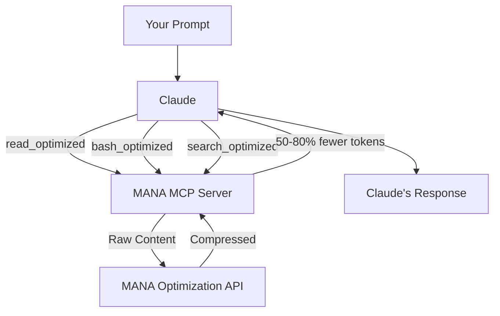

# MANA - Double Your Claude Usage

MANA optimizes the token-heavy tool outputs that eat through your Claude limits. File reads, command outputs, search results - they all get intelligently compressed before reaching Claude, saving 50-80% of tokens on every operation. Your prompts and Claude's responses stay untouched.

**Result: 2x the coding sessions from the same subscription.**

---

## How It Works



**Smart Routing** — Every tool action routes to a lightweight model benchmarked as the most accurate for that specific job.

**Lean Processing** — Optimized models handle the heavy lifting—reading files, parsing bash outputs, extracting precise answers.

**Compounding Savings** — Leaner responses mean leaner context. Savings stack with every turn. Longer sessions, fewer tokens burned.

---

## Quick Start

### Step 1: Get Your API Key

1. Sign up at [devmana.ai](https://devmana.ai)
2. Go to **Settings > API Keys**
3. Click **Create API Key**
4. Copy your key (you'll need it in Step 3)

### Step 2: Install MANA

**Option A: Claude Code Plugin (Recommended)**

```bash
/plugin marketplace add scottymade/mana
/plugin install mana-mcp
```

**Option B: Universal Installer**

```bash
curl -fsSL https://raw.githubusercontent.com/scottymade/mana/main/install.sh | bash
```

**Option C: Manual Download**

Download your platform's binary from the [Releases page](https://github.com/scottymade/mana/releases):

| Your System | Download |
|-------------|----------|
| Mac (M1/M2/M3) | `mana-mcp-darwin-arm64` |
| Mac (Intel) | `mana-mcp-darwin-x64` |
| Linux | `mana-mcp-linux-x64` |
| Windows | `mana-mcp-windows-x64.exe` |

### Step 3: Configure Your IDE

#### Claude Code / Claude Desktop

Add to `~/.claude/settings.json`:

```json
{
  "mcpServers": {
    "mana": {
      "command": "/usr/local/bin/mana-mcp",
      "args": ["--api-key=YOUR_API_KEY"]
    }
  }
}
```

#### Cursor

Add to `~/.cursor/mcp.json`:

```json
{
  "mcpServers": {
    "mana": {
      "command": "/usr/local/bin/mana-mcp",
      "args": ["--api-key=YOUR_API_KEY"]
    }
  }
}
```

#### Windsurf

Add to `~/.codeium/windsurf/mcp_config.json`:

```json
{
  "mcpServers": {
    "mana": {
      "command": "/usr/local/bin/mana-mcp",
      "args": ["--api-key=YOUR_API_KEY"]
    }
  }
}
```

### Step 4: Install the Claude Instructions (Required)

MANA works by providing optimized alternatives to Claude's built-in tools. For Claude to use these optimized tools, you need to install the **MANA instructions file** which tells Claude to prefer MANA's tools over its native ones.

#### For Claude Code

Copy the instructions to your global Claude config:

```bash
# Download and install globally (applies to all projects)
curl -fsSL https://raw.githubusercontent.com/scottymade/mana/main/instructions/CLAUDE_INSTRUCTIONS.md >> ~/.claude/CLAUDE.md
```

Or for a specific project only:

```bash
# Install to current project
mkdir -p .claude
curl -fsSL https://raw.githubusercontent.com/scottymade/mana/main/instructions/CLAUDE_INSTRUCTIONS.md >> .claude/CLAUDE.md
```

#### For Cursor

```bash
# Download to your rules folder
mkdir -p ~/.cursor/rules
curl -fsSL https://raw.githubusercontent.com/scottymade/mana/main/instructions/CLAUDE_INSTRUCTIONS.md -o ~/.cursor/rules/mana.md
```

Or for a specific project:

```bash
curl -fsSL https://raw.githubusercontent.com/scottymade/mana/main/instructions/CLAUDE_INSTRUCTIONS.md >> .cursorrules
```

#### For Windsurf

```bash
# Add to your project
curl -fsSL https://raw.githubusercontent.com/scottymade/mana/main/instructions/CLAUDE_INSTRUCTIONS.md >> .windsurfrules
```

#### What the Instructions Do

The instructions file teaches Claude to:

- Use `read_optimized` instead of the native `Read` tool
- Use `bash_optimized` instead of the native `Bash` tool
- Use `search_optimized` instead of `Glob` and `Grep`
- Use `list_directory_optimized` for directory listings

Without this file, Claude will use its built-in tools and you won't get any token savings. **This step is required for MANA to work.**

---

## Verify It's Working

After setup, ask Claude to read a file:

```
Read the package.json file and tell me what dependencies this project uses.
```

You should see output like:

```
read_optimized [EXTRACT] -> 1,247 tokens saved (72% reduction) [1,732 -> 485]
```

If you see token savings in the output, MANA is working.

---

## Troubleshooting

### "Command not found" error

Make sure the binary is in your PATH:

```bash
# Check if installed
which mana-mcp

# If not found, add to PATH or use full path in config
export PATH="$HOME/.local/bin:$PATH"
```

### Claude isn't using MANA tools

1. Verify the instructions file is installed (see Step 4)
2. Restart your IDE after making changes
3. Check that the instructions appear in your IDE's context

### "Invalid API key" error

1. Verify your key at [devmana.ai/settings](https://devmana.ai/settings)
2. Check for typos in your config file
3. Ensure the key hasn't been revoked

### No optimization happening

- Files under 1,200 characters skip optimization (overhead exceeds benefit)
- Check your API usage at [devmana.ai/dashboard](https://devmana.ai/dashboard)

---

## Support

- **Documentation**: [devmana.ai/docs](https://devmana.ai/docs)
- **Issues**: [GitHub Issues](https://github.com/scottymade/mana/issues)
- **Email**: hi@scottymadellc.com

---

## License

Proprietary - Copyright 2024 ScottyMade LLC
